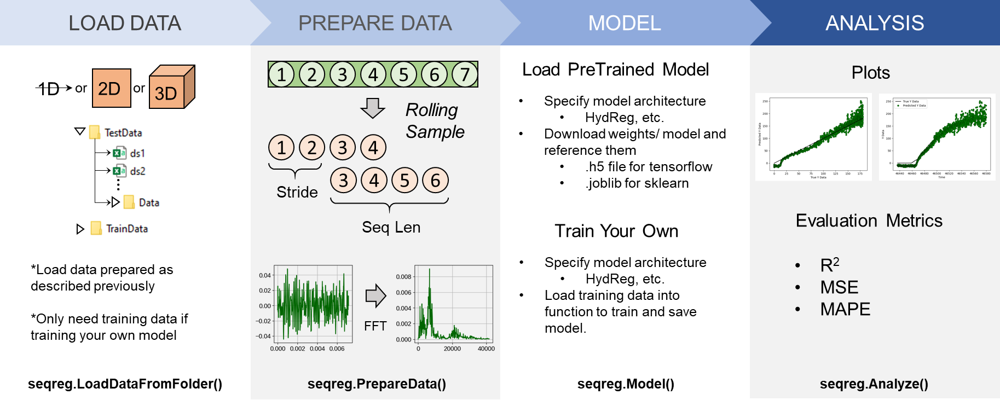

  

---  

This package is for aiding in developing and running sequence regression models. The main use case is for boiling heat flux prediction via hydrophone, AE sensor, and optical image data. However, it is presented in a such a way where it can utilized for general sequence regression models if the data is prepared in the proper format. This package uses models trained in tensorflow and sklearn.  

## Installation:  

## Use:  

### Saving Data Format

  

  

SeqReg can be used for regression from 1D, 2D, or 3D (wip) inputs. It is designed to work with multiple sets of experimental data. Each experimental dataset must be saved in a csv. One column show contain time (or index) one should contain the output labels (in this case heat flux) corresponding to each input at the specified time. The other column should contain the model inputs. This could be just a single value, a path relative to the csv to an array saved in a txt file, or a path to an image.   

### Using SeqReg

  

To use SeqReg there are four main functions that must be used:

* **Load Data**: This function will load in the data from the folders given they follow the format described. The user will input the location of the data and type. This function can be used for loading both training and testing data depending on the overall end goal.
* **Prepare Data**: This function is used to convert the long sequences from each dataset into shorter sequences and the outputs. It also includes the option for converting each sequence into the frequency domain. 
* **Model**: This function provides a few options for defining the model:
  * **Load Pre-Trained Model**: For loading pretrained models, first the correct architecture must be defined. Additionally the corresponding weights must be downloaded and the path should be included in the function. There are currently 2 pretrained models provided from past work.

    |Model Name|Weights Location|Description|Parameters|
    |----------|----------------|-----------|----------|
    |HydReg| Link| Predicts heat flux from hydrophone sound data recorded in a pool boiling experiment| FFT=True, SeqLen=4000|
    
  * **Train on Your Own Data**: If you want to use a predefined model achitecture with your own data just set train to true, pass in training data, and define the weights location as where you want the weights/model to be saved. Set the model name to one of the already defined models. 
  * **Train Your Own Data on Custom Model**: pending
* **Analysis**: This function allows for performance visualization and returns a dictionary of performance metrics.  

References
