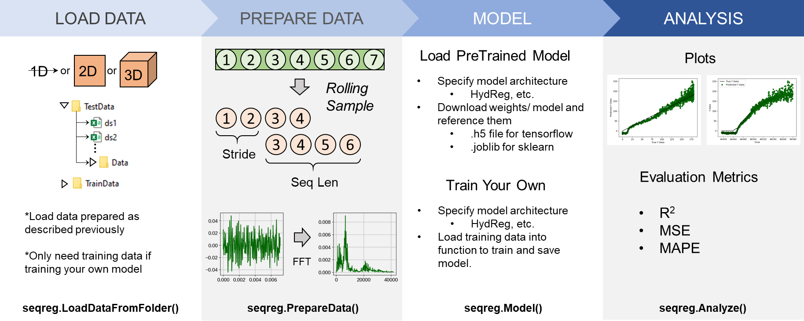

.. ReadTheDocs-BubbleID documentation master file, created by
   sphinx-quickstart on Fri Jan 24 10:15:08 2025.
   You can adapt this file completely to your liking, but it should at least
   contain the root `toctree` directive.

Documentation
==================================

---------------------------------------

This package is for aiding in developing and running sequence regression models. The main use case is for boiling heat flux prediction via hydrophone, AE sensor, and optical image data. However, it is presented in a such a way where it can utilized for general sequence regression models if the data is prepared in the proper format. This package uses tensorflow and sklearn.

Installation:
-------------
::

   pip install seqreg

.. toctree::
   :maxdepth: 2
   :caption: Contents:

   tutorials
   seqregmodule
   poolboilingmodule

